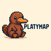
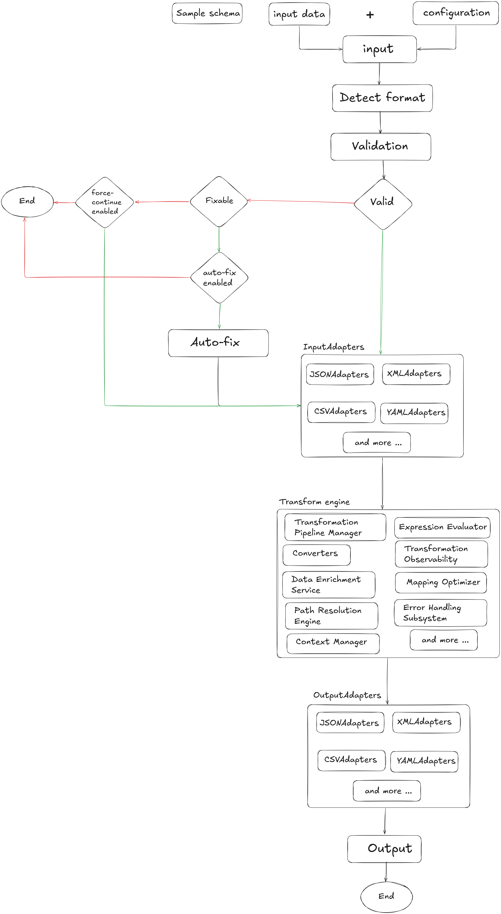

# Platymap

Platymap is a high-performance, open-source data mapper library written in Kotlin, designed to be fully extensible and usable across various ecosystems through its flexible APIs. Inspired by the unique adaptability of the platypus, Platymap seamlessly transforms data between most common formats with powerful transformation capabilities along the way. Its modular, plugin-based architecture ensures effortless extension, deep integration, and smooth interoperability with any tech stack.

## Key Features:

🦆 Format Agnostic: JSON, XML, CSV, YAML, and more.

⚡ High Performance: Stream-based processing to handle large datasets efficiently.

🔄 Two-Way Mapping: Configure bidirectional mappings easily.

🔍 Schema Inference: Automatically detects schemas from sample data.

✨ Data Transformation: Apply powerful transformations on-the-fly.

🔄 Conditional Mapping: Map fields based on conditional logic.

🔗 Extensible Adapters: Plugin support for custom formats and transformations.

🐛 Rich Validation & Error Handling: Detailed validation before processing.

## Architecture

## Roadmap

- 

## Contributing

We welcome contributions!

## License

Platymap is released under the MIT License.